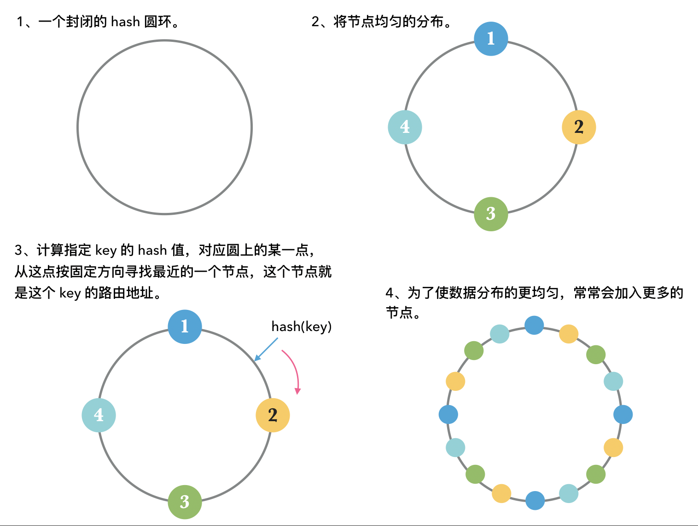

# 实现 memcached 客户端：TCP、连接池、一致性哈希、自定义协议。

废话不多说，文本将带你实现一个简单的 memcached 客户端。

## 集群：一致性哈希
memcached 本身并不支持集群，为了使用集群，我们可以自己在客户端实现路由分发，将相同的 key 路由到同一台 memcached 上去即可。
路由算法有很多，这里我们使用一致性哈希算法。

一致性哈希算法的原理：




一致性哈希算法已经有开源库 [`hashring`](https://github.com/3rd-Eden/node-hashring) 实现，基本用法：
```
const HashRing = require('hashring');

// 输入集群地址构造 hash ring
const ring = new HashRing(['127.0.0.1:11211', '127.0.0.2:11211']);

// 输入 key 获取指定节点
const host = ring.get(key);
```

## TCP 编程

包括 memcached 在内的许多系统对外都是通过 TCP 通信。在 Node.js 中建立一个 TCP 连接并进行数据的收发很简单：

```
const net = require('net');

const socket = new net.Socket();
socket.connect({
    host: host,                     // 目标主机
    port: port,                     // 目标端口
    // localAddress: localAddress,  // 本地地址
    // localPort: localPort,        // 本地端口
});

socket.setKeepAlive(true);      // 保活

// 连接相关
socket.on('connect', () => {
    console.log(`socket connected`);
});
socket.on('error', error => {
    console.log(`socket error: ${error}`);
});
socket.on('close', hadError => {
    console.log(`socket closed, transmission error: ${hadError}`);
});


socket.on('data', data => {
    // 接受数据
});

socket.write(data); // 发送数据

```

一条连接由唯一的五元组确定，所谓的五元组就是：协议（比如 TCP 或者 UDP）、本地地址、本地端口、远程地址、远程端口。
系统正是通过五元组去区分不同的连接，其中本地地址和本地端口由于在缺省情况下会自动生成，常常会被我们忽视。


## 连接池

一次完整的 TCP 通信过程为：三次握手，建立连接  -->  数据传递  -->  挥手，关闭连接。

我们都知道握手建立连接的过程是非常消耗资源的，而连接池就是为了解决这个问题，连接池是一个通用的模型，它包括：
- 建立连接，将连接放入池中。
- 需要使用连接时（进行数据收发），从连接池中取出连接。
- 连接使用完成后，将连接放回到池中。
- 其它。

可以看到所谓的连接池其实就是在连接使用完成后并不是立即关闭连接，而是让连接保活，等待下一次使用，从而避免反复建立连接的过程。

正如上文所述，连接池是一个通用的模型，我们这里直接使用开源库 [`generic-pool`](https://github.com/coopernurse/node-pool) 。

池化 TCP 连接示例：
```
const net = require('net');
const genericPool = require('generic-pool');

// 自定义创建连接池的函数
function _buildPool(remote_server) {
    const factory = {
        create: function () {
            return new Promise((resolve, reject) => {
                const host = remote_server.split(':')[0];
                const port = remote_server.split(':')[1];
                const socket = new net.Socket();
                socket.connect({
                    host: host, // 目标主机
                    port: port, // 目标端口
                });
                socket.setKeepAlive(true);
                socket.on('connect', () => {
                    console.log(`socket connected: ${remote_server} , local: ${socket.localAddress}:${socket.localPort}`);
                    resolve(socket);
                });
                socket.on('error', error => {
                    console.log(`socket error: ${remote_server} , ${error}`);
                    reject(error);
                });
                socket.on('close', hadError => {
                    console.log(`socket closed: ${remote_server} , transmission error: ${hadError}`);
                });
            });
        },
        destroy: function (socket) {
            return new Promise((resolve) => {
                socket.destroy();
                resolve();
            });
        },
        validate: function (socket) { // validate socket
            return new Promise((resolve) => {
                if (socket.connecting || socket.destroyed || !socket.readable || !socket.writable) {
                    return resolve(false);
                } else {
                    return resolve(true);
                }
            });
        }
    };
    const pool = genericPool.createPool(factory, {
        max: 10,            // 最大连接数
        min: 0,             // 最小连接数
        testOnBorrow: true, // 从池中取连接时进行 validate 函数验证
    });
    return pool;
}

// 连接池基本使用
const pool = _buildPool('127.0.0.1:11211'); // 构建连接池

const s = await pool.acquire();             // 从连接池中取连接

await pool.release(s);                      // 使用完成后释放连接
```

## 对接自定义协议

包括 memcached 在内的许多系统都定义了一套自己的协议用于对外通信，为了实现 memcached 客户端当然就要遵守它的协议内容。

[memcached 客户端协议](https://github.com/memcached/memcached/blob/master/doc/protocol.txt)，我们实现最简单的 get 方法:

发送的数据格式:
```
get <key>\r\n
```

接受的数据格式:
```
VALUE <key> <flags> <bytes>\r\n
<data block>\r\n
```

实现示例：
```
// 定义一个请求方法并返回响应数据
function _request(command) {
    return new Promise(async (resolve, reject) => {
        try {
            // ...这里省略了连接池构建相关部分
            const s = await pool.acquire(); // 取连接

            const bufs = [];
            s.on('data', async buf => { // 监听 data 事件接受响应数据
                bufs.push(buf);

                const END_BUF = Buffer.from('\r\n'); // 数据接受完成的结束位
                if (END_BUF.equals(buf.slice(-2))) {
                    s.removeAllListeners('data'); // 移除监听
                    try {
                        await pool.release(s); // 释放连接
                    } catch (error) { }
                    const data = Buffer.concat(bufs).toString();
                    return resolve(data);
                }
            });

            s.write(command);
        } catch (error) {
            return reject(error);
        }
    });
}


// get
function get(key) {
    return new Promise(async (resolve, reject) => {
        try {
            const command = `get ${key}\r\n`;
            const data = await _request(key, command);

            // ...响应数据的处理，注意有省略

            // key not exist
            if (data === 'END\r\n') {
                return resolve(undefined);
            }

            /*
                VALUE <key> <flags> <bytesLength>\r\n
                <data block>\r\n
            */
            const data_arr = data.split('\r\n');
            const response_line = data_arr[0].split(' ');
            const value_flag = response_line[2];
            const value_length = Number(response_line[3]);

            let value = data_arr.slice(1, -2).join('');
            value = unescapeValue(value); // unescape \r\n
            // ...有省略
            return resolve(value);
        } catch (error) {
            return reject(error);
        }
    });
}
```

以上示例都单独拿出来了，其实是在整合在一个 class 中的：
```
class Memcached {
    constructor(serverLocations, options) {
        this._configs = {
            ...{
                pool: {
                    max: 1,
                    min: 0,
                    idle: 30000,             // 30000 ms.
                },
                timeout: 5000,              // timeout for every command, 5000 ms.
                retries: 5,                 // max retry times for failed request.
                maxWaitingClients: 10000,   // maximum number of queued requests allowed
            }, ...options
        };
        this._hashring = new HashRing(serverLocations);
        this._pools = {}; // 通过 k-v 的形式存储具体的地址及它的连接池
    }

    _buildPool(remote_server) {
        // ...
    }

    _request(key, command) {
        // ...
    }


    // get
    async get(key) {
        // ...
    }

    // ... 其他方法
}
```

```
// 使用实例
const memcached = new Memcached(['127.0.0.1:11211'], {
    pool: {
        max: 10,
        min: 0
    }
});

const key = 'testkey';
const result = await memcached.get(key);
```

完整的示例可以看 [io-memcached](https://www.npmjs.com/package/io-memcached) 。