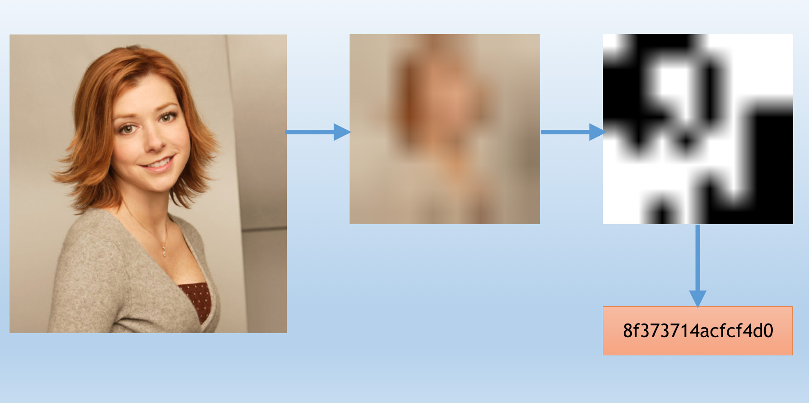

# 以图搜图系统概述

以图搜图指的是根据图像内容搜索出相似内容的图像。

构建一个以图搜图系统需要解决两个最关键的问题：首先，提取图像特征；其次，特征数据搜索引擎，即特征数据构建成数据库并提供相似性搜索的功能。

## 图像特征表示

介绍三种方式。

### 图像哈希
图像通过一系列的变换和处理最终得到的一组哈希值称之为图像的哈希值，而中间的变换和处理过程则称之为哈希算法。

图像的哈希值是对这张图像的整体抽象表示。

比如 Average Hash 算法的计算过程：

1. Reduce size : 将原图压缩到 8 x 8 即 64 像素大小，忽略细节。
2. Reduce color : 灰度处理得到 64 级灰度图像。
3. Average the colors : 计算 64 级灰度均值。
4. Compute the bits : 二值化处理，将每个像素与上一步均值比较并分别记为 0 或者 1 。
5. Construct the hash : 根据上一步结果矩阵构成一个 64 bit 整数，比如按照从左到右、从上到下的顺序。最后得到的就是图像的均值哈希值。

参考：http://www.hackerfactor.com/blog/?/archives/432-Looks-Like-It.html

图像哈希算法有很多种，包含但不限于:

- `AverageHash` : 也叫 Different Hash
- `PHash` : Perceptual Hash
- `MarrHildrethHash` : Marr-Hildreth Operator Based Hash
- `RadialVarianceHash` : Image hash based on Radon transform
- `BlockMeanHash` : Image hash based on block mean
- `ColorMomentHash` : Image hash based on color moments

我们最常见可能就是 `PHash` 。

图像哈希可以对抗一定程度的水印、压缩、噪声等影响，即通过对比图像哈希值的 Hamming distance （汉明距离）可以判断两幅图像的内容是否相似。

图像的哈希值是对这张图像的整体抽象表示，局限性也很明显，由于是对图像整体进行的处理，一旦我们对整体性进行了破坏，比如在原图加一个黑边就几乎无法判断相似性了。

### 传统特征
在计算机视觉领域早期，创造了很多经典的手工设计的特征算法，比如 `SIFT`

如上图所示，通过 `SIFT` 算法提取出来的一系列的特征点。

一幅图像提取出来的特征点有多个，且每一个特征点都是一个局部向量，为了进行相似性计算，通常需要先将这一系列特征点融合编码为一个全局特征，也就是局部特征向量融合编码为一个全局特征向量（用这个全局特征向量表示一幅图像），融合编码相关的算法包括但不限于:
- `BOW`
- `Fisher vector`
- `VLAD`

### CNN 特性
人工智能兴起之后，基于 CNN 卷积神经网络提取图像特征越来越主流。

通过 CNN 提取出来的图像特征其实也是一个多维向量，比如使用 VGG16 模型提取特征可参考: https://keras.io/applications/#extract-features-with-vgg16

## 搜索引擎
由于将图像转换为了特征向量，因此搜索引擎所要做的就是其实就是向量检索。

这里直接推荐 [Milvus](https://www.milvus.io/) ，刚开源不久，可以很方便快捷的使用在工程项目上，具体的相关内容直接查阅官方文档即可。