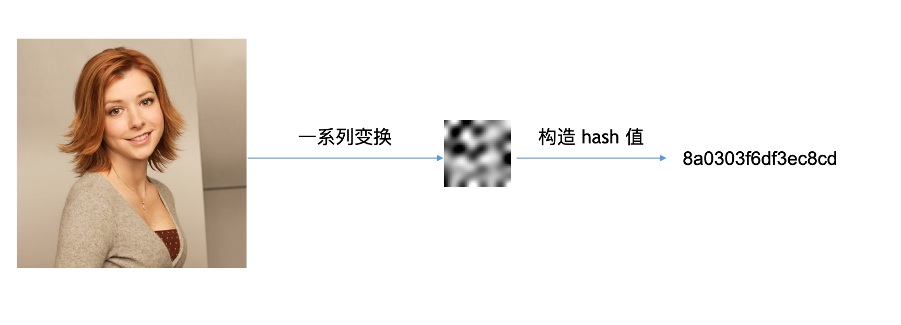

# 又拍图片管家亿级图像之搜图系统的两代演进及底层原理

## 前言

又拍图片管家当前服务了千万级用户，管理了百亿级图片。当用户的图库变得越来越庞大时，业务上急切的需要一种方案能够快速定位图像，即直接输入图像，然后根据输入的图像内容来找到图库中的原图及相似图，而以图搜图服务就是为了解决这个问题。

本人有幸独立负责并实施了整个以图搜图系统从技术调研、到设计验证、以及最后工程实现的全过程。而整个以图搜图服务也是经历了两次的整体演进：从 2019 年初开始第一次技术调研，经历春节假期，2019 年 3、4 月份第一代系统整体上线；2020 年初着手升级方案调研，经历春节及疫情，2020 年 4 月份开始第二代系统的整体升级。

本文将会简述两代搜图系统背后的技术选型及基本原理。

---------
## 基础概要

### 图像是什么？

与图像打交道，我们必须要先知道：图像是什么？

答案：像素点的集合。

比如：


左图红色圈中的部分其实就是右图中一系列的像素点。

再举例：


假设上图红色圈的部分是一幅图像，其中每一个独立的小方格就是一个像素点（简称像素），像素是最基本的信息单元，而这幅图像的大小就是 11 x 11 px 。

### 图像的数学表示

每个图像都可以很自然的用矩阵来表示，每个像素点对应的就是矩阵中的一个元素。

#### 二值图像

二值图像的像素点只有黑白两种情况，因此每个像素点可以由 0 和 1 来表示。

比如一张 4 * 4 二值图像：
```
0 1 0 1
1 0 0 0
1 1 1 0
0 0 1 0
```

#### RGB 图像

红（Red）、绿（Green）、蓝（Blue）作为三原色可以调和成任意的颜色，对于 RGB 图像，每个像素点包含 RGB 共三个通道的基本信息，类似的，如果每个通道用 8 bit 表示即 256 级灰度，那么一个像素点可以表示为：
```
( [0 ... 255], [0 ... 255], [0 ... 255] )
```

比如一张 4 * 4 RGB 图像：
```
(156, 22, 45)  (255, 0, 0)  (0, 156, 32)  (14, 2, 90)
(12, 251, 88)  (78, 12, 3)  (94, 90, 87)  (134, 0, 2)
(240, 33, 44)  (5, 66, 77)  (1, 28, 167)  (11, 11, 11)
(0, 0, 0)      (4, 4, 4)    (50, 50, 50)  (100, 10, 10)
```

图像处理的本质实际上就是对这些像素矩阵进行计算。


### 搜图的技术问题

如果只是找原图，也就是像素点完全相同的图像，那么直接对比它们的 `MD5` 值即可。然而，图像在网络的传输过程中，常常会遇到诸如压缩、水印等等情况，而 `MD5` 算法的特点是，即使是小部分内容变动，其最终的结果却是天差地别，换句话说只要图片有一个像素点不一致，最后都是无法对比的。

对于一个以图搜图系统而言，我们要搜的本质上其实是内容相似的图片，为此，我们需要解决两个基本的问题：
- 把图像表示或抽象为一个计算机数据
- 这个数据必须是可以进行对比计算的

直接用专业点的话说就是：
- 图像的特征提取
- 特征计算（相似性计算）

----------
## 第一代搜图系统

### 特性提取 - 图像抽象

第一代搜图系统在特征提取上使用的是 `Perceptual hash` 即 `pHash` 算法，这个算法的基本原理是什么？



如上图所示，`pHash` 算法就是对图像整体进行一系列变换最后构造 hash 值，而变换的过程可以理解为对图像进行不断的抽象，此时如果对另外一张相似内容的图像进行同样的整体抽象，那么其结果一定是非常接近的。

### 特性计算 - 相似性计算

对于两张图像的 `pHash` 值，具体如何计算其相似的程度？答案是 `Hamming distance` 汉明距离，汉明距离越小，图像内容越相似。

汉明距离又是什么？就是对应位置不同比特位的个数。

例如：
```
第一个值： 0 1 0 1 0
第二个值： 0 0 0 1 1
```
以上两个值的对应位置上有 2 个比特位是不相同的，因此它们的汉明距离就是 2 。

OK ，相似性计算的原理我们知道了，那么下一个问题是：如何去计算亿级图片对应的亿级数据的汉明距离？简而言之，就是如何搜索？

在项目早期其实我并没有找到一个满意的能够快速计算汉明距离的工具（或者说是计算引擎），因此我的方案进行了一次变通。

变通的思想是：如果两个 pHash 值的汉明距离是接近的，那么将 pHash 值进行切割后，切割后的每一个小部分大概率相等。

例如：
```
第一个值： 8 a 0 3 0 3 f 6
第二个值： 8 a 0 3 0 3 d 8
```

我们把上面这两个值分割成了 8 块，其中 6 块的值是完全相同的，因此可以推断它们的汉明距离接近，从而图像内容也相似。

经过变换之后，其实你可以发现，汉明距离的计算问题，变成了等值匹配的问题，我把每一个 pHash 值给分成了 8 段，只要里面有超过 5 段的值是完全相同的，那么我就认为他们相似。

等值匹配如何解决？这就很简单了，传统数据库的条件过滤不就可以用了嘛。

当然，我这里用的是 `ElasticSearch`（ `ES` 的原理本文就不介绍了，读者可以另行了解），在 `ES` 里的具体操作就是多 `term` 匹配然后 `minimum_should_match` 指定匹配程度。

为什么搜索会选择 `ElasticSearch` ？第一点，它能实现上述的搜索功能；第二点，图片管家项目本身就正在用 `ES` 提供全文搜索的功能，使用现有资源，成本是非常低的。

### 第一代系统总结

第一代搜图系统在技术上选择了 `pHash` + `ElasticSearch` 的方案，它拥有如下特点：
- `pHash` 算法计算简单，可以对抗一定程度的压缩、水印、噪声等影响。
- `ElasticSearch` 直接使用了项目现有资源，在搜索上没有增加额外的成本。

当然这套系统的局限性也很明显：由于 `pHash` 算法是对图像的整体进行抽象表示，一旦我们对整体性进行了破坏，比如在原图加一个黑边，就会几乎无法判断相似性。

为了突破这个局限性，底层技术截然不同的第二代搜图系统应运而生。


-------
## 第二代搜图系统

### 特性提取

在计算机视觉领域，使用人工智能相关的技术基本上已经成了主流，同样，我们第二代搜图系统的特征提取在底层技术上使用的是 `CNN` 卷积神经网络。

`CNN` 卷积神经网络这个词让人比较难以理解，重点是回答两个问题：
- `CNN` 能干什么？
- 搜图为什么能用 `CNN` ?

AI 领域有很多赛事，图像分类是其中一项重要的比赛内容，而图像分类就是要去判断图片的内容到底是猫、是狗、是苹果、是梨子、还是其它对象类别。

`CNN` 能干什么？提取特征，进而识物，我把这个过程简单的理解为，从多个不同的维度去提取特征，衡量一张图片的内容或者特征与猫的特征有多接近，与狗的特征有多接近，等等等等，选择最接近的就可以作为我们的识别结果，也就是判断这张图片的内容是猫，还是狗，还是其它。

`CNN` 识物又跟我们找相似的图像有什么关系？我们要的不是最终的识物结果，而是从多个维度提取出来的特征向量，两张内容相似的图像的特征向量一定是接近的。


具体使用哪种 `CNN` 模型？

我使用的是 `VGG16` ，为什么选择它？首先，`VGG16` 拥有很好的泛化能力，也就是很通用；其次，`VGG16` 提取出来的特征向量是 `512` 维，维度适中，如果维度太少，精度可能会受影响，如果维度太多，存储和计算这些特征向量的成本会比较高。

### 向量搜索引擎

从图像提取特征向量的问题已经解决了，那么剩下的问题就是：
- 特征向量如何存储？
- 特征向量如何计算相似性，即如何搜索？

对于这两个问题，直接使用开源的向量搜索引擎 [Milvus](https://www.milvus.io/) 就可以很好的解决，截至目前，[Milvus](https://www.milvus.io/) 在我们的生产环境一直运行良好。


### 第二代系统总结

第二代搜图系统在技术上选择了 `CNN` + `Milvus` 的方案，而这种基于特征向量的搜索在业务上也提供了更好的支持。


------
## 相关文章

本人之前已经写过两篇相关的文章：

- [以图搜图系统概述](https://segmentfault.com/a/1190000022208225)
- [以图搜图系统工程实践](https://segmentfault.com/a/1190000022341617)