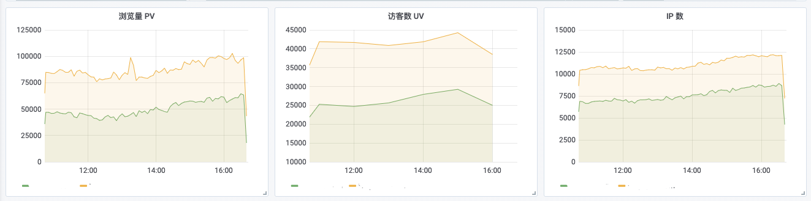
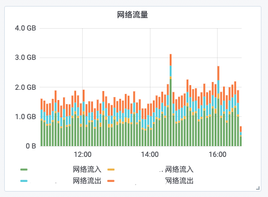
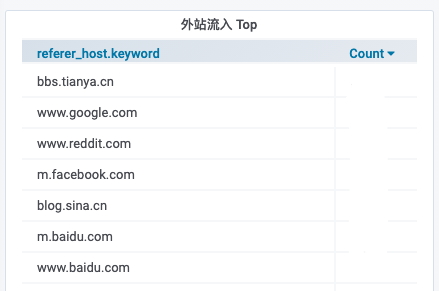
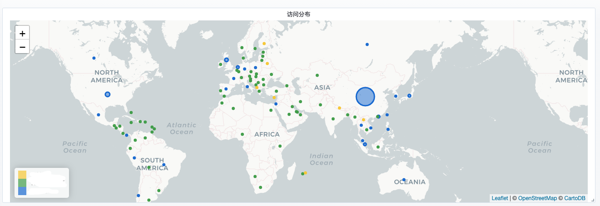
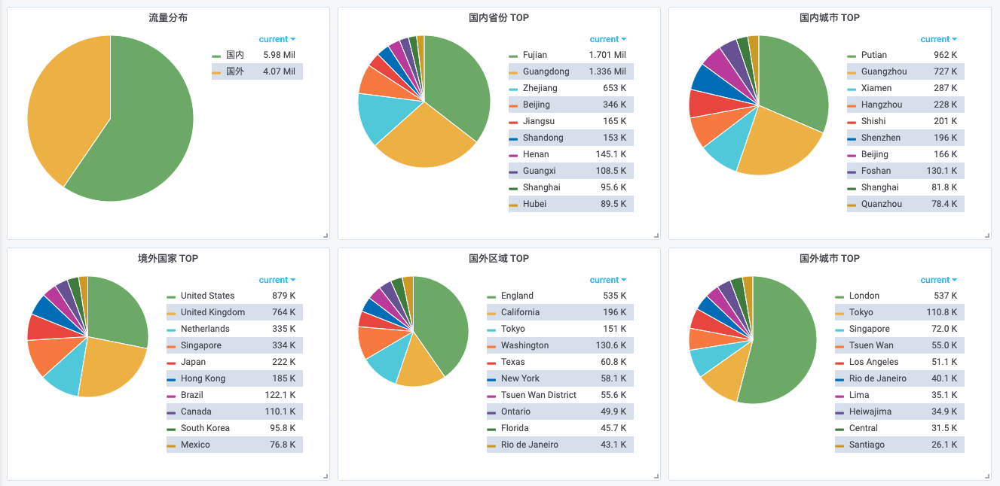
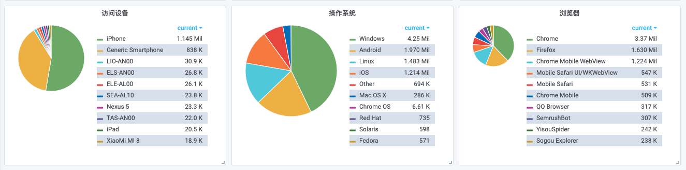
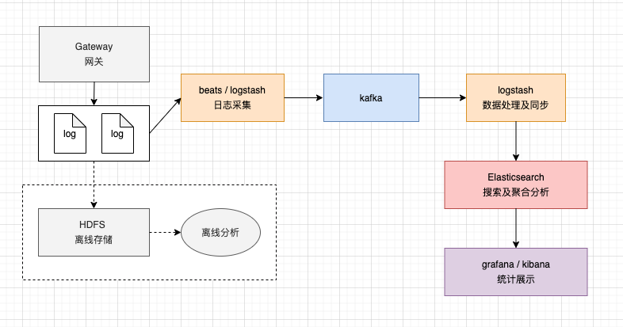

# 请求日志分析系统

## 请求日志记录哪些数据

- `time_local` : 请求的时间
- `remote_addr` : 客户端的 IP 地址
- `request_method` : 请求方法
- `request_schema` : 请求协议，常见的 http 和 https
- `request_host` : 请求的域名
- `request_path` : 请求的 path 路径
- `request_query` : 请求的 query 参数
- `request_size` : 请求的大小
- `referer` : 请求来源地址，假设你在 a.com 网站下贴了 b.com 的链接，那么当用户从 a.com 点击访问 b.com 的时候，referer 记录的就是 a.com ，这个是浏览器的行为
- `user_agent` : 客户端浏览器相关信息
- `status` : 请求的响应状态
- `request_time` : 请求的耗时
- `bytes_sent` : 响应的大小

很多时候我们会使用负载网关去代理转发请求给实际的后端服务，这时候请求日志还会包括以下数据：
- `upstream_host` : 代理转发的 host
- `upstream_addr` : 代理转发的 IP 地址
- `upstream_url` : 代理转发给服务的 url
- `upstream_status` : 上游服务返回的 status
- `proxy_time` : 代理转发过程中的耗时

## 数据衍生

客户端 IP 地址可以衍生出以下数据：
- asn 相关信息：
    - `asn_asn` : 自治系统编号，IP 地址是由自治系统管理的，比如中国联通上海网就管理了所有上海联通的IP
    - `as_org` : 自治系统组织，比如中国移动、中国联通
- geo 地址位置信息：
    - `geo_location` : 经纬度
    - `geo_country` : 国家
    - `geo_country_code` : 国家编码
    - `geo_region` : 区域（省份）
    - `geo_city` : 城市

`user_agent` 可以解析出以下信息：
- `ua_device` : 使用设备
- `ua_os` : 操作系统
- `ua_name` : 浏览器

## 数据分析

- `PV` / `QPS` : 页面浏览次数 / 每秒请求数
- `UV` : 访问的用户人数，很多网站用户无序登录也能访问，这时可以根据 IP + user_agent 的唯一性确定用户
- `IP` 数 : 访问来源有多少个 IP 地址

 

- 网络流量 : 根据 `request_size` 请求的大小计数网络流入流量，`bytes_sent` 响应大小计算网络流出流量

 

- `referer` 来源分析

 

- 客户请求的地理位置分析：根据 IP 地址衍生的 `geo` 数据

 

- 客户设备分析：根据 `user_agent` 提取数据

 

- 请求耗时统计：根据 `request_time` 数据
    - p99、p95、p90 延迟（前多少百分比请求的耗时，比如 p99 就是前 99% 请求的耗时）
    - 长耗时异常监控
 

- 响应状态监控：根据 `status` 数据
    - 各个状态码的响应占比
    - 5xx 服务端异常数量
 

- 结合业务分析：请求的 `request_path` 地址和 `request_query` 参数一定是对应具体业务的，例如
    - 请求某个相册的地址是 /album/:id ，那么日志中的 `request_path` 对应的就是对相册进行了一次访问
    - 进行站内搜索的地址是 `/search?q=<关键词>` ，那么统计 `request_path` 是 `/search` 的日志条数就可以知道进行了多少次搜索，统计 `request_query` 中 `q` 的参数就可以知道搜索关键词的情况

## 通用架构

日志系统使用 ELK + kafka 构建是业界比较主流的方案，beats、 logstash 进行日志采集搬运，kafka 存储日志等待消费，elasticsearch 进行数据的聚合分析，grafana 和 kibana 进行图形化展示。